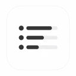

# Hi there 👋, I'm Kevin (烂人文)

  
  
  

---

### 🌟 Featured Flagship Apps

<table align="center" width="100%">
  <tr>
    <td align="center" width="20%" valign="top">
      <a href="https://keylaunch.lanrenwen.com">
          
        <b>KeyLaunch (键启)</b>
      </a>  
      macOS 快捷启动与调度 
      <a href="https://keylaunch.lanrenwen.com">官网 ↗</a> · <a href="https://apps.apple.com/app/id6759540480">App Store</a>
    </td>
    <td align="center" width="20%" valign="top">
      <a href="https://pauseloop.lanrenwen.com">
          
        <b>PauseLoop</b>
      </a>  
      专注与 20-20-20 护眼计时 
      <a href="https://pauseloop.lanrenwen.com">官网 ↗</a> · <a href="https://apps.apple.com/app/id6790401487">App Store</a>
    </td>
    <td align="center" width="20%" valign="top">
      <a href="https://clipbar.lanrenwen.com">
          
        <b>ClipBar</b>
      </a>  
      macOS 菜单栏 AI 额度看板 
      <a href="https://clipbar.lanrenwen.com">官网 ↗</a> · <code>Homebrew</code>
    </td>
    <td align="center" width="20%" valign="top">
      <a href="https://englishcc.com/">
          
        <b>EnglishCC</b>
      </a>  
      YouTube 双语字幕与查词 
      <a href="https://englishcc.com/">官网 ↗</a> · <a href="https://chromewebstore.google.com/detail/englishcc/iimpbffhdjodajgccmlmdblnbjhkfpnc">Chrome 商店</a>
    </td>
    <td align="center" width="20%" valign="top">
      <a href="https://highlightshare.lanrenwen.com/">
          
        <b>HighlightShare</b>
      </a>  
      网页划词高亮与金句卡片 
      <a href="https://highlightshare.lanrenwen.com/">官网 ↗</a> · <a href="https://chromewebstore.google.com/detail/highlight-share/nmjdekhjdeebjbckapcpjagkjcabcgla">Chrome 商店</a>
    </td>
  </tr>
</table>

  👉 <b><a href="https://lanrenwen.com/">前往 lanrenwen.com 查看全部 17 款作品 ↗</a></b>

---

### 📦 Product Matrix / 全部作品

#### 🍎 macOS 原生工具
- **[KeyLaunch (键启)](https://keylaunch.lanrenwen.com)** — 原生 macOS 快捷唤起与工作流增强工具 (`SwiftUI`) · [官网](https://keylaunch.lanrenwen.com) · [App Store](https://apps.apple.com/app/id6759540480) · `brew install --cask LanrenwenStudio/apps/key-launch`
- **[PauseLoop](https://pauseloop.lanrenwen.com)** — 原生专注与 20-20-20 护眼休息计时器 (`SwiftUI`) · [官网](https://pauseloop.lanrenwen.com) · [App Store](https://apps.apple.com/app/id6790401487) · `brew install --cask LanrenwenStudio/apps/pause-loop`
- **[ClipBar](https://clipbar.lanrenwen.com)** — 原生 macOS 菜单栏 AI 额度看板 (Codex / Claude / Grok / Kimi) · [官网](https://clipbar.lanrenwen.com) · `brew install --cask LanrenwenStudio/apps/clipbar`
- **[MouseMidModifier (鼠标中键修改器)](https://mousemidmodifier.lanrenwen.com)** — 零延迟将鼠标中键映射为键盘任意按键 · [官网](https://mousemidmodifier.lanrenwen.com) · `brew install --cask LanrenwenStudio/apps/mouse-mid-modifier`

#### 🌐 浏览器扩展 (Chrome / Edge)
- **[EnglishCC](https://englishcc.com/)** — 沉浸式外语视频双语字幕提取与划词查词扩展 · [官网](https://englishcc.com/) · [Chrome 商店](https://chromewebstore.google.com/detail/englishcc/iimpbffhdjodajgccmlmdblnbjhkfpnc)
- **[SideStash](https://sidestash.lanrenwen.com/)** — 基于侧边栏的网页片段与标签页集中管理工具 · [官网](https://sidestash.lanrenwen.com/) · [Chrome 商店](https://chromewebstore.google.com/detail/side-stash/khbkjkjokbmldbaelpknjbfoecdkehbk)
- **[HighlightShare (划词分享)](https://highlightshare.lanrenwen.com/)** — 网页选中文本一键导出高颜值社交分享卡片 · [官网](https://highlightshare.lanrenwen.com/) · [Chrome 商店](https://chromewebstore.google.com/detail/highlight-share/nmjdekhjdeebjbckapcpjagkjcabcgla)
- **[suno download](https://sunodownload.lanrenwen.com/)** — Suno 歌曲与播放列表原始音频提取与批量下载 · [官网](https://sunodownload.lanrenwen.com/) · [Chrome 商店](https://chromewebstore.google.com/detail/suno-download-lossless-au/pgfjfbchdaifeokikhgkgihmildohmkl)

#### ⚡ 跨平台桌面端 / 移动端 / 小程序
- **[音乐剪辑 (Music Master)](https://yinyuejianji.com/)** — 跨平台音频剪辑、拼接与格式转换桌面工作站 (`Electron`) · [官网](https://yinyuejianji.com/)
- **[MP3 剪辑器](https://apps.apple.com/app/id6747578080)** — 高精度波形剪辑、格式转换与人声伴奏提取 · [App Store](https://apps.apple.com/app/id6747578080) (iOS / 微信小程序 / 鸿蒙)
- **[写歌大师](https://apps.apple.com/app/id6740610342)** — 基于 AI 的音乐与歌词生成、音轨创作助手 · [App Store](https://apps.apple.com/app/id6740610342) (iOS / 微信小程序)
- **[纪要大师](https://apps.apple.com/app/id6758984144)** — 语音听写、实时会议记录与 AI 智能纪要提炼 · [App Store](https://apps.apple.com/app/id6758984144) (iOS)

#### 🔴 HarmonyOS 鸿蒙原生应用
- **剪韵音乐剪辑 (`JianYun`)** — 鸿蒙原生高精度音频波形剪切与淡入淡出工具 (ArkTS & 微信小程序)
- **小夏图处理 (`ImageCraft`)** — 基于 ArkTS 的本地轻量图片压缩、拼图与隐私水印工具
- **小夏二维码 (`QrCode`)** — 极简离线二维码/条形码生成、样式美化与扫码识别
- **光影提词器 (`LightScript`)** — 悬浮置顶提词与智能语速自适应滚动拍摄助手
- **家用库存 (`home-inventory`)** — 离线家庭物品收纳分类与保质期临期智能提醒

---

### 🛠️ Tech Stack & Skills

  <b>Languages & Core</b> 
  
  
  
  
  
  

  <b>Frameworks & Platforms</b> 
  
  
  
  
  
  
  

  <b>Tools & Workflow</b> 
  
  
  
  
  
  

---

### 📈 GitHub Stats

  
  

  Built with ❤️ by Kevin · Powered by <a href="https://lanrenwen.com/">lanrenwen.com</a>

